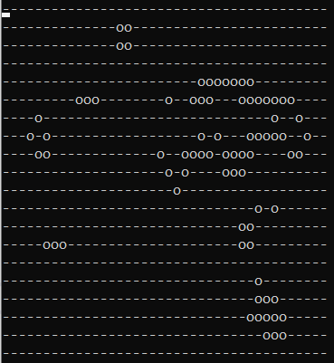

# Instruction!

The Game of Life, also known simply as Life, is a cellular automaton devised by the British mathematician John Horton Conway in 1970.

## .net core 2.x
 It's a .net core project.   
 Initialization and drawing of the board are provided through CustomExtension while core method as Neighbors are exposed in the Board class.   
 
 